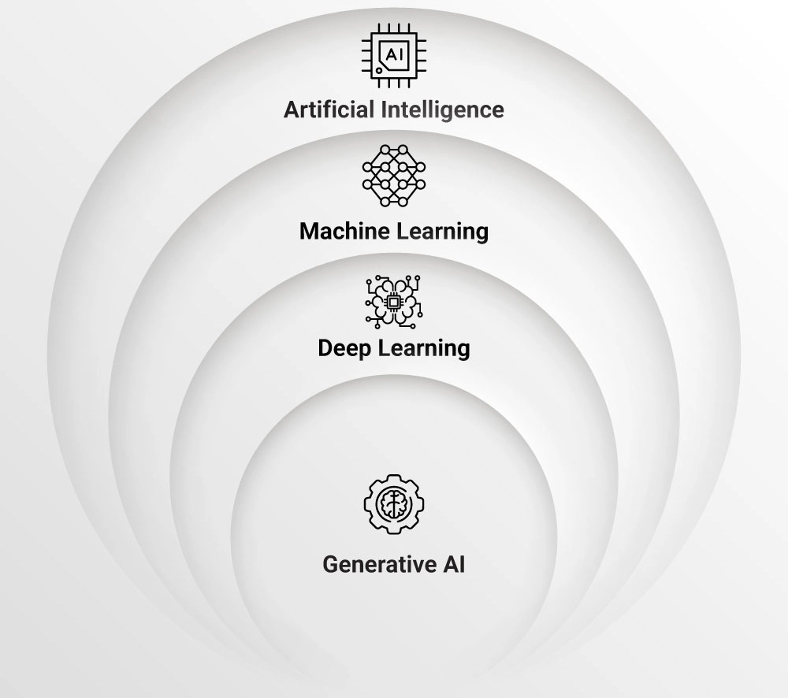

# Decoding Intelligence
## A Journey into AI and Machine Learning

  

  

    Presented by: 
    
      Harikrishna P S
      
        
LinkedIn: <a href="https://www.linkedin.com/in/harikrishna-ps/" target="_blank" class="text-blue-600 underline">harikrishna-ps</a>

        
Email: <a href="mailto:harikrishnapspknl@gmail.com" class="text-blue-600 underline">harikrishnapspknl@gmail.com</a>

        
WhatsApp: +918921888155

      
    
  

<!--

  <button @click="$slidev.nav.openInEditor()" title="Open in Editor" class="text-xl icon-btn opacity-50 !border-none !hover:text-white">
    <carbon:edit />
  </button>

-->

---
layout: center
class: text-center
---

# What is Artificial Intelligence (AI)?

  

---
layout: default
---

# What is Artificial Intelligence (AI)?

## Definition

AI refers to machines that can simulate human intelligence

### Key Capabilities:
- 🧠 **Learning** from experience
- 🤔 **Reasoning** through problems  
- 🔍 **Problem-solving** autonomously
- 💬 **Understanding** natural language

## Real-World Examples

  <h4 class="font-semibold text-blue-600 dark:text-blue-400 text-sm">Virtual Assistants</h4>
  
Siri, Alexa, Google Assistant

  <h4 class="font-semibold text-green-600 dark:text-green-400 text-sm">Recommendation Engines</h4>
  
Netflix, Spotify, Amazon

  <h4 class="font-semibold text-purple-600 dark:text-purple-400 text-sm">Smart Systems</h4>
  
Navigation, Translation, Recognition

---
layout: default
---

# What is Machine Learning (ML)?

## Core Concept

ML is a subset of AI where machines learn patterns from data

### Key Characteristics:
- 📊 **Data-Driven** learning process
- 🔄 **Automatic improvement** through experience
- 🎯 **Pattern recognition** capabilities
- 📈 **Performance optimization** over time

## Practical Applications

  

  

    
Email Spam Detection

    
Automatically filters unwanted emails

  

  

  

    
Voice Recognition

    
Converts speech to text accurately

  

  

  

    
Fraud Detection

    
Identifies suspicious transactions

  

---
layout: center
class: text-center
---

# AI, ML, DL & Generative AI

  

---
layout: two-cols
class: pt-2 pb-32
---

# Traditional Programming vs Machine Learning

  

    <h2 class="text-xl font-bold mb-4 text-center">Traditional Programming</h2>
    

      

        

          
Rules

          
+

          
Data

          
=

          
Output

        

        
You provide the logic

      

    

    

      <strong>Example:</strong> 
      Tax calculation with predefined rules: 
      • Income < $50,000 → 10% tax 
      • Income ≥ $50,000 → 20% tax
    

  

  

    <h2 class="text-xl font-bold mb-4 text-center">Machine Learning</h2>
    

      

        

          
Data

          
+

          
Output

          
=

          
Rules

        

        
Machine learns the logic

      

    

    

      <strong>Example:</strong> 
      ML learns patterns from examples: 
      • Train on thousands of tax examples 
      • Model discovers complex patterns 
      • Predicts tax for new cases
    

  

---
layout: center
class: text-center
---

# Evolution of AI

From Rules to Superintelligence

  

    
🧩

    
Rule-Based

    
1950s–1980s

  

  

    
📊

    
Classical ML

    
1990s–2000s

  

  

    
🧠

    
Deep Learning

    
2010s

  

  

    
🎨

    
Generative AI

    
2020s

  

  

    
🤖

    
Agentic AI

    
Present

  

  

    
🚀

    
Superintelligence

    
Future

  

---
layout: default
---

# Rule-Based Systems

The Foundation of Early AI

## How They Work
- Use **IF-THEN** logic statements
- Predetermined rules and conditions
- Direct programming of decision trees
- Expert knowledge encoded manually

## Examples in Action

  🌡️ **Basic Thermostats**: IF temp > 75°F THEN turn on AC

  📧 **Simple Spam Filters**: IF contains "FREE MONEY" THEN mark as spam

## Simple Logic Example

Basic spam filter logic: 
• Check for keywords: "free", "winner", "urgent" 
• If any keyword found → Mark as SPAM 
• Otherwise → Mark as NOT SPAM

## Limitations
- ❌ Cannot adapt to new situations
- ❌ Requires manual rule updates  
- ❌ Difficult to handle complexity

---
layout: default
---

# Machine Learning Era

Learning Patterns from Data

## Key Characteristics
- **Learns patterns** from training data
- **Automatically improves** with more examples
- **Generalizes** to unseen situations
- **Adapts** without manual programming

## Popular Algorithms

  

    

    

      Linear Regression – Finds the best straight line to predict values (e.g., predicting house prices from size)
    

  

  

    

    

      Logistic Regression – Helps decide between two options (e.g., will it rain: yes or no?)
    

  

## Real Applications

### Email Classification Process

• Train on thousands of email examples 
• Extract features from text automatically 
• Learn patterns that distinguish spam 
• Predict classification for new emails

### Other Applications
- 💳 **Fraud Detection**: Credit card transactions
- 🎵 **Music Recommendation**: Spotify, Apple Music  
- 📈 **Stock Prediction**: Market analysis
- 🚗 **Route Optimization**: GPS navigation

---
layout: default
---

# Types of Machine Learning

How Machines Learn from Data

  

    <h3 class="font-semibold text-blue-600 dark:text-blue-400 mb-2">Supervised Learning</h3>
    
The model learns from examples with the correct answers provided. (Like a student learning with an answer key)

    <ul class="text-xs mt-2 list-disc list-inside opacity-80">
      <li>Spam detection</li>
      <li>House price prediction</li>
    </ul>
  

  

    <h3 class="font-semibold text-green-600 dark:text-green-400 mb-2">Unsupervised Learning</h3>
    
The model finds patterns in data without any answers given. (Like sorting photos by similarity)

    <ul class="text-xs mt-2 list-disc list-inside opacity-80">
      <li>Customer segmentation</li>
      <li>Grouping news articles</li>
    </ul>
  

  

    <h3 class="font-semibold text-yellow-600 dark:text-yellow-400 mb-2">Reinforcement Learning</h3>
    
The model learns by trial and error, getting rewards for good actions. (Like training a pet with treats)

    <ul class="text-xs mt-2 list-disc list-inside opacity-80">
      <li>Game playing (Chess, Go)</li>
      <li>Robotics</li>
    </ul>
  

---
layout: default
---

# Supervised Learning

Learning with a Teacher - Labeled Data

  

    <h3 class="text-xl font-semibold mb-4 text-blue-600 dark:text-blue-400">How It Works</h3>
    

      

        <h4 class="font-semibold mb-2">📚 Training Process</h4>
        <ul class="space-y-1 opacity-80">
          <li>• Input data with known outputs</li>
          <li>• Model learns input → output mapping</li>
          <li>• Makes predictions on new data</li>
        </ul>
      

             

         <h4 class="font-semibold mb-2">🎯 Common Algorithms</h4>
         <ul class="space-y-1 opacity-80">
           <li>• Linear Regression</li>
           <li>• Logistic Regression</li>
           <li>• Decision Trees</li>
           <li>• Random Forest</li>
           <li>• Support Vector Machines</li>
         </ul>
       

    

  

  

    
    

      
<strong>Input Data</strong> → <strong>Model</strong> → <strong>Predicted Output</strong>

      
Training with labeled examples

    

  

---
layout: default
---

# Unsupervised Learning

Learning Without a Teacher - Finding Hidden Patterns

  

    <h3 class="text-xl font-semibold mb-4 text-green-600 dark:text-green-400">How It Works</h3>
    

      

        <h4 class="font-semibold mb-2">🔍 Discovery Process</h4>
        <ul class="space-y-1 opacity-80">
          <li>• No predefined answers provided</li>
          <li>• Model finds natural groupings</li>
          <li>• Discovers hidden structures</li>
        </ul>
      

             

         <h4 class="font-semibold mb-2">🎯 Common Algorithms</h4>
         <ul class="space-y-1 opacity-80">
           <li>• K-Means Clustering</li>
           <li>• Hierarchical Clustering</li>
           <li>• Principal Component Analysis</li>
           <li>• DBSCAN</li>
           <li>• Autoencoders</li>
         </ul>
       

    

  

  

    
    

      
<strong>Raw Data</strong> → <strong>Pattern Discovery</strong> → <strong>Natural Groups</strong>

      
Finding hidden structures in data

    

  

---
layout: default
---

# Reinforcement Learning

Learning Through Trial and Error - Reward-Based Learning

  

    <h3 class="text-xl font-semibold mb-4 text-yellow-600 dark:text-yellow-400">How It Works</h3>
    

      

        <h4 class="font-semibold mb-2">🎮 Learning Process</h4>
        <ul class="space-y-1 opacity-80">
          <li>• Agent takes actions in environment</li>
          <li>• Receives rewards/penalties</li>
          <li>• Learns optimal strategy over time</li>
        </ul>
      

             

         <h4 class="font-semibold mb-2">🎯 Common Algorithms</h4>
         <ul class="space-y-1 opacity-80">
           <li>• Q-Learning</li>
           <li>• Deep Q-Network (DQN)</li>
           <li>• Policy Gradient Methods</li>
           <li>• Actor-Critic Methods</li>
           <li>• Monte Carlo Tree Search</li>
         </ul>
       

    

  

  

    
    

      
<strong>Action</strong> → <strong>Environment</strong> → <strong>Reward</strong>

      
Learning optimal behavior through experience

    

  

---
layout: default
---

# Frozen Lake Environment

A Classic Reinforcement Learning Challenge

Frozen Lake represents a fundamental reinforcement learning environment where an AI agent navigates through a grid-based world, learning optimal strategies to reach a target destination while avoiding obstacles.

  

    <h3 class="text-lg font-semibold mb-3 text-blue-600">Environment Overview</h3>
    
    
Grid-based navigation challenge

  

  
  

    <h3 class="text-lg font-semibold mb-3 text-green-600">AI Agent Learning</h3>
    
    
Agent learning optimal path

  

---

# Deep Learning Revolution

Neural Networks Inspired by the Brain

## What Makes It Special
- Multi-layered neural networks (hence "deep")
- Handles complex data like images, audio, text
- Automatic feature extraction from raw data
- Scales with big data and computing power

## Neural Network Structure

  

    

      

        

        

        

        
Input

      

      
→

      

        

        

        

        

        
Hidden

      

      
→

      

        

        
Output

      

    

  

## Breakthrough Applications

  

    <h4 class="font-semibold text-blue-600 dark:text-blue-400 mb-1 text-xs">👁️ Computer Vision</h4>
    <ul class="text-xs space-y-0.5 opacity-80">
      <li>• Facial recognition systems</li>
      <li>• Medical image analysis</li>
      <li>• Autonomous vehicle vision</li>
    </ul>
  

  

    <h4 class="font-semibold text-green-600 dark:text-green-400 mb-1 text-xs">🎤 Speech Processing</h4>
    <ul class="text-xs space-y-0.5 opacity-80">
      <li>• Speech-to-text conversion</li>
      <li>• Voice assistants</li>
      <li>• Real-time translation</li>
    </ul>
  

  

    <h4 class="font-semibold text-purple-600 dark:text-purple-400 mb-1 text-xs">📝 Natural Language</h4>
    <ul class="text-xs space-y-0.5 opacity-80">
      <li>• Language translation</li>
      <li>• Sentiment analysis</li>
      <li>• Text summarization</li>
    </ul>
  

---

# Convolutional Neural Networks (CNNs)

🔠Image & Video Processing

## What Are CNNs?
- Designed to work with images and visual patterns
- Uses "filters" to detect shapes, edges, colors
- Translation invariant recognition

## Key Applications

  

    <h4 class="font-semibold text-blue-600 dark:text-blue-400 text-xs">📸 Computer Vision</h4>
    
Image classification, object detection, face recognition

  

  

    <h4 class="font-semibold text-green-600 dark:text-green-400 text-xs">🚗 Autonomous Vehicles</h4>
    
Lane detection, traffic signs, pedestrian detection

  

  

    <h4 class="font-semibold text-purple-600 dark:text-purple-400 text-xs">🏥 Medical Imaging</h4>
    
Tumor detection, disease diagnosis, X-ray analysis

  

---

# Recurrent Neural Networks (RNNs)

🔄 Sequential Data Processing

## What Are RNNs?
- Designed for sequence data (where order matters)
- Has "memory" of past steps to process the next one
- Hidden state carries information through time

## Key Applications

  

    <h4 class="font-semibold text-green-600 dark:text-green-400 text-xs">🎤 Speech & Audio</h4>
    
Speech-to-text, voice recognition, music generation

  

  

    <h4 class="font-semibold text-blue-600 dark:text-blue-400 text-xs">📝 Natural Language</h4>
    
Language modeling, machine translation, text generation

  

  

    <h4 class="font-semibold text-purple-600 dark:text-purple-400 text-xs">📊 Time Series</h4>
    
Stock forecasting, weather prediction, sensor data

  

---

# Long Short-Term Memory (LSTM)

🧠 Advanced Memory Networks

## What is LSTM?
- Special RNN types that remember things for longer
- Avoid forgetting important info over long sequences

## Key Applications

  

    <h4 class="font-semibold text-green-600 dark:text-green-400 text-xs">🗣️ Language Processing</h4>
    
Language translation, speech recognition, text summarization

  

  

    <h4 class="font-semibold text-blue-600 dark:text-blue-400 text-xs">📊 Time Series</h4>
    
Stock forecasting, weather prediction, sensor data analysis

  

  

    <h4 class="font-semibold text-purple-600 dark:text-purple-400 text-xs">🎵 Audio Processing</h4>
    
Music generation, noise reduction, audio classification

  

---

# Transformer Networks

🧠 Attention-Based Learning

## What Are Transformers?
- Attention mechanism - focus on relevant parts
- Parallel processing - no sequential dependencies
- Self-attention - understand relationships

## Key Applications

  

    <h4 class="font-semibold text-purple-600 dark:text-purple-400 mb-1 text-xs">🤖 Large Language Models</h4>
    
GPT, BERT, T5, Claude, LLaMA

  

  

    <h4 class="font-semibold text-blue-600 dark:text-blue-400 mb-1 text-xs">🌐 Multimodal AI</h4>
    
Text-to-image, video understanding, cross-modal translation

  

  

    <h4 class="font-semibold text-green-600 dark:text-green-400 mb-1 text-xs">💬 Conversational AI</h4>
    
ChatGPT, customer service, virtual assistants

  

---
layout: default
---

# Generative AI Era

The Revolution of AI-Powered Content Creation

## What is Generative AI?
AI systems that can <b>create original, human-like content</b> across multiple modalities, revolutionizing how we interact with technology

### Key Capabilities:
- 🎨 <b>Create Images</b> from text descriptions
- ✍️ <b>Write Text</b> like articles and stories
- 💻 <b>Generate Code</b> in different programming languages
- 🎵 <b>Make Music</b> and audio content
- 🎬 <b>Produce Videos</b> from simple prompts
- 🔬 <b>Help Research</b> and scientific work

## How It Works

  

    <h4 class="font-semibold text-blue-600 dark:text-blue-400 mb-1 text-xs">🧠 Core Technology</h4>
    

      Uses <b>Large Language Models</b> (LLMs) and <b>Diffusion Models</b> trained on massive datasets to understand patterns and generate human-like responses
    

  

  
  

    <h4 class="font-semibold text-green-600 dark:text-green-400 mb-1 text-xs">🚀 Revolutionary Impact</h4>
    <ul class="text-xs space-y-0.5 opacity-80">
      <li>• Democratization of creative tools</li>
      <li>• 10x faster content production</li>
      <li>• Multilingual content generation</li>
      <li>• Personalized experiences at scale</li>
    </ul>
  

  

---
layout: default
---

# Large Language Models (LLMs)

The Foundation of Modern AI

## What are LLMs?
AI models trained on vast amounts of text data to understand and generate human-like language

### Key Characteristics:
- 📚 <b>Massive training data</b> (billions of parameters)
- 🧠 <b>Context understanding</b> and reasoning
- 🔄 <b>Transfer learning</b> across tasks
- 💬 <b>Natural language</b> processing
- 🎯 <b>Task adaptation</b> through prompting

## Types & Applications
- 🔤 <b>Text Generation</b>: Content creation, translation, code generation, creative writing
- 💡 <b>Problem Solving</b>: Mathematical reasoning, logical analysis, decision support, research
- 🤖 <b>Conversational AI</b>: Chatbots, virtual assistants, customer support, tutoring

### Training Process:
- <b>Pre-training</b> on diverse text corpora
- <b>Fine-tuning</b> for specific tasks
- <b>Reinforcement learning</b> from human feedback
- <b>Continuous improvement</b> through updates

---
layout: default
---

# Generative AI in Action

  

---
layout: default
---

# Generative AI: Popular Examples

Famous Tools and Platforms

  

    

      <h4 class="font-semibold text-green-600 dark:text-green-400 mb-0.5 text-xs">💬 ChatGPT</h4>
      
Conversational AI for text generation, coding help, and problem-solving

      
<b>Model:</b> GPT-4, GPT-3.5

    

    

      <h4 class="font-semibold text-blue-600 dark:text-blue-400 mb-0.5 text-xs">🎨 DALL-E & Midjourney</h4>
      
Create stunning images from text descriptions

      
<b>Model:</b> DALL-E 3, Midjourney v6

    

    

      <h4 class="font-semibold text-orange-600 dark:text-orange-400 mb-0.5 text-xs">🤖 Anthropic Claude</h4>
      
Advanced conversational AI focused on safety and helpfulness

      
<b>Model:</b> Claude 3.5 Sonnet, Claude 3 Opus

    

  

  

    

      <h4 class="font-semibold text-purple-600 dark:text-purple-400 mb-0.5 text-xs">👨‍💻 GitHub Copilot</h4>
      
AI pair programmer that suggests code as you type

      
<b>Model:</b> OpenAI GPT models

    

    

      <h4 class="font-semibold text-cyan-600 dark:text-cyan-400 mb-0.5 text-xs">🔎 Perplexity AI</h4>
      
AI-powered search and question answering assistant

      
<b>Model:</b> Claude 3.5, GPT-4, Mixtral

    

    

      <h4 class="font-semibold text-blue-600 dark:text-blue-400 mb-0.5 text-xs">🧠 DeepSeek</h4>
      
Open-source large language model for research and applications

      
<b>Model:</b> DeepSeek R1

    

  

---
layout: default
---

# Prompt Engineering

The Art of Communicating with AI

## What is Prompt Engineering?
The practice of designing and optimizing inputs (prompts) to get the best possible outputs from AI models

### Key Principles:
- 🎯 <b>Be specific</b> and clear
- 📝 <b>Provide context</b> and examples
- 🔄 <b>Iterate and refine</b> prompts
- ⚖️ <b>Balance detail</b> with conciseness
- 🎨 <b>Use structured formats</b>

## Common Techniques
- 🎯 <b>Few-shot learning</b> with examples
- 🧠 <b>Chain-of-thought</b> prompting
- 👤 <b>Role-based</b> instructions
- 📋 <b>Output formatting</b> specifications

---
layout: default
---

# Embeddings in GenAI

Converting Text to Mathematical Representations

## What are Embeddings?
Numerical representations of text that capture semantic meaning, allowing AI models to understand relationships between words and concepts

### Key Characteristics:
- 🔢 <b>Vector format</b> - Multi-dimensional arrays
- 🧠 <b>Semantic meaning</b> - Similar words have similar vectors
- 📏 <b>Mathematical distance</b> - Measures word relationships
- 🎯 <b>Context-aware</b> - Meaning changes with context

## Applications & Benefits

  

    <h4 class="font-semibold text-blue-600 dark:text-blue-400 mb-1 text-xs">🚀 Use Cases</h4>
    <ul class="text-xs space-y-0.5 opacity-80">
      <li>Semantic search & similarity</li>
      <li>Recommendation systems</li>
      <li>Text classification</li>
      <li>RAG & knowledge retrieval</li>
    </ul>
  

  

    <h4 class="font-semibold text-green-600 dark:text-green-400 mb-1 text-xs">💡 Advantages</h4>
    <ul class="text-xs space-y-0.5 opacity-80">
      <li>Efficient text processing</li>
      <li>Better understanding of context</li>
      <li>Enables vector databases</li>
      <li>Improves AI model performance</li>
    </ul>
  

---
layout: default
---

# Retrieval-Augmented Generation (RAG)

Enhancing AI with External Knowledge

## What is RAG?
A technique that combines <b>information retrieval</b> with <b>text generation</b> to provide more accurate and up-to-date responses

### How It Works:
1. 🔍 <b>Query Processing</b> - Understand user question
2. 📚 <b>Knowledge Retrieval</b> - Search relevant documents
3. 🧠 <b>Context Integration</b> - Combine retrieved info with AI knowledge
4. ✍️ <b>Response Generation</b> - Create accurate, informed answer

## Benefits & Applications

  

    <h4 class="font-semibold text-green-600 dark:text-green-400 mb-1 text-xs">🚀 Advantages</h4>
    <ul class="text-xs space-y-0.5 opacity-80">
      <li>Up-to-date information access</li>
      <li>Reduced hallucination</li>
      <li>Domain-specific knowledge</li>
      <li>Transparent source citations</li>
    </ul>
  

  

    <h4 class="font-semibold text-purple-600 dark:text-purple-400 mb-1 text-xs">💼 Use Cases</h4>
    <ul class="text-xs space-y-0.5 opacity-80">
      <li>Customer support chatbots</li>
      <li>Research assistants</li>
      <li>Document Q&A systems</li>
      <li>Knowledge management</li>
    </ul>
  

---
layout: default
---

# Vector Databases

Storing and Searching High-Dimensional Data

## What are Vector Databases?
Specialized databases designed to store, index, and search high-dimensional vector representations (embeddings) efficiently

### Key Features:
- 🔢 <b>Vector storage</b> - Optimized for embedding data
- ⚡ <b>Fast similarity search</b> - Find similar vectors quickly
- 📊 <b>Scalability</b> - Handle millions of vectors
- 🎯 <b>Semantic search</b> - Find content by meaning, not just keywords

## Popular Vector Databases

  

    <h4 class="font-semibold text-blue-600 dark:text-blue-400 mb-1 text-xs">🚀 Leading Solutions</h4>
    <ul class="text-xs space-y-0.5 opacity-80">
      <li>Pinecone - Managed vector database</li>
      <li>Weaviate - Open-source vector DB</li>
      <li>Qdrant - High-performance vector search</li>
      <li>Chroma - Embedding database</li>
    </ul>
  

  

    <h4 class="font-semibold text-green-600 dark:text-green-400 mb-1 text-xs">💡 Use Cases</h4>
    <ul class="text-xs space-y-0.5 opacity-80">
      <li>RAG systems & knowledge bases</li>
      <li>Recommendation engines</li>
      <li>Semantic search applications</li>
      <li>AI-powered content discovery</li>
    </ul>
  

---
layout: default
---

# Agentic AI

Goal-Driven Autonomous Systems

### What Makes It Special
AI that can <b>act autonomously</b> to achieve specific goals

### Key Characteristics:
- 🎯 <b>Goal-oriented</b> behavior
- 🤖 <b>Autonomous decision-making</b>
- 🔄 <b>Multi-step task execution</b>
- 🧠 <b>Reasoning and planning</b>
- 🌐 <b>Interaction with external systems</b>

### How It Differs

<table class="w-full text-xs mt-2">
  <thead>
    <tr>
      <th class="bg-gray-100 dark:bg-gray-800 p-2 text-left font-semibold text-red-600 dark:text-red-400">Traditional AI</th>
      <th class="bg-gray-100 dark:bg-gray-800 p-2 text-left font-semibold text-green-600 dark:text-green-400">Agentic AI</th>
    </tr>
  </thead>
  <tbody>
    <tr>
      <td class="bg-white dark:bg-gray-900 p-2">Responds to prompts, Needs human input for every step</td>
      <td class="bg-white dark:bg-gray-900 p-2">Takes initiative and acts independently, Plans and adapts to new situations</td>
    </tr>
  </tbody>
</table>

## Real-World Applications

  

    <h4 class="font-semibold text-blue-600 dark:text-blue-400 mb-1 text-xs">🤖 Personal AI Assistants</h4>
    <ul class="text-xs space-y-0.5 opacity-80">
      <li>Schedule meetings automatically</li>
      <li>Book travel arrangements</li>
      <li>Manage email responses</li>
    </ul>
  

  

    <h4 class="font-semibold text-green-600 dark:text-green-400 mb-1 text-xs">🚗 Autonomous Vehicles</h4>
    <ul class="text-xs space-y-0.5 opacity-80">
      <li>Navigate complex traffic</li>
      <li>Make split-second decisions</li>
      <li>Adapt to road conditions</li>
    </ul>
  

  

---
layout: center
class: text-center
---

# Agentic AI Workflow

Understanding How Autonomous AI Systems Operate

  

---
layout: center
class: text-center
---

# Multi Agent System

Collaborative AI Agents Working Together

  

---
layout: center
---

# Model Context Protocol (MCP)

Standardizing AI Model Communication and Context

## What is MCP?
A standardized protocol that enables AI models to communicate with external tools, databases, and systems while maintaining context and security

### Key Features:
- 🔗 <b>Standardized Interface</b> - Common protocol for all models
- 🛡️ <b>Security & Safety</b> - Controlled access to external resources
- 🔄 <b>Context Preservation</b> - Maintains conversation state
- 🛠️ <b>Tool Integration</b> - Connects to databases, APIs, services

## Benefits & Applications

  

    <h4 class="font-semibold text-blue-600 dark:text-blue-400 mb-1 text-xs">🚀 Use Cases</h4>
    <ul class="text-xs space-y-0.5 opacity-80">
      <li>AI agent tool access</li>
      <li>Database querying</li>
      <li>API integrations</li>
      <li>File system operations</li>
    </ul>
  

  

    <h4 class="font-semibold text-green-600 dark:text-green-400 mb-1 text-xs">💡 Advantages</h4>
    <ul class="text-xs space-y-0.5 opacity-80">
      <li>Interoperability</li>
      <li>Security control</li>
      <li>Scalable architecture</li>
      <li>Developer-friendly</li>
    </ul>
  

---
layout: center
---

# Superintelligence (Future Stage)

The Hypothetical Next Frontier

## Definition
Hypothetical AI that <b>surpasses human intelligence</b> in all domains

### Potential Capabilities:
- 🚀 <b>Space exploration</b> and colonization, including autonomous missions and interstellar travel
- 💡 <b>Innovation beyond</b> human imagination—creating new technologies, art, and ideas
- 🏥 <b>Transforming healthcare</b> with personalized medicine, early diagnosis, and robotic surgery
- 🛡️ <b>Advanced security</b> and risk prediction to prevent disasters and conflicts
- 🤝 <b>Enhancing human potential</b> through brain-computer interfaces and cognitive augmentation

## Critical Questions

  

    <h4 class="font-semibold text-red-600 dark:text-red-400 mb-0.5 text-xs">⚠️ Control Problem</h4>
    
How do we ensure superintelligent AI remains aligned with human values and under human control?

  

  

    <h4 class="font-semibold text-yellow-600 dark:text-yellow-400 mb-0.5 text-xs">🎯 Alignment Problem</h4>
    
How do we specify what we want AI to do in a way that doesn't lead to unintended consequences?

  

  

    <h4 class="font-semibold text-blue-600 dark:text-blue-400 mb-0.5 text-xs">⚖️ Responsibility</h4>
    
Who is responsible for the decisions and actions of superintelligent systems?

  

---
layout: default
---

# Applications in Electronics

AI Transforming Electronic Systems

  

    

      <b>📺 Smart TVs</b> Content recommendation, voice control, auto optimization
    

    

      <b>❄️ Smart Fridges</b> Food management, energy saving, shopping lists
    

    

      <b>🠠Home Automation</b> Learning patterns, predictive control, energy savings
    

    

      <b>⚡ Smart Circuits</b> Adaptive power management, self-healing, fault detection
    

    

      <b>🌠IoT Devices</b> Remote monitoring, smart sensors, real-time alerts
    

  

  

    

      <b>⌚ Smartwatches</b> Health monitoring, activity prediction, coaching
    

    

      <b>🏃‍♂️ Fitness Trackers</b> Sleep analysis, workout tips, health insights
    

    

      <b>🭠Predictive Maintenance</b> Monitor equipment health, reduce downtime, optimize maintenance
    

    

      <b>🚗 Smart Vehicles</b> Autonomous driving, collision avoidance, driver assistance, smart navigation
    

  

---
layout: default
---

# Emerging Trends: AI + Electronics

The Future is Connected and Intelligent

## AI + IoT Integration

  <h3 class="font-semibold text-base mb-2">🌐 Smart Interconnected Devices</h3>
  <ul class="space-y-1 text-xs">
    <li class="flex items-center">Devices that learn from each other</li>
    <li class="flex items-center">Collective intelligence networks</li>
    <li class="flex items-center">Seamless automation ecosystems</li>
  </ul>

## Edge AI Revolution

  <h4 class="font-semibold text-purple-600 dark:text-purple-400 mb-2 text-sm">🔄 AI On-Device Processing</h4>
  

    
✅ Benefits: Reduced latency, privacy protection, offline capability

    
📱 Applications: Smart cameras, voice assistants, autonomous vehicles

  

### Specialized AI Hardware

  <h4 class="font-semibold text-red-600 dark:text-red-400 mb-1 text-sm">🎮 NVIDIA GPUs</h4>
  <ul class="text-xs space-y-1 opacity-80">
    <li>• RTX series for AI workloads</li>
    <li>• CUDA parallel processing</li>
    <li>• Data center solutions (A100, H100)</li>
  </ul>

  <h4 class="font-semibold text-blue-600 dark:text-blue-400 mb-1 text-sm">🧠 Google TPU</h4>
  <ul class="text-xs space-y-1 opacity-80">
    <li>• Tensor Processing Units</li>
    <li>• Optimized for machine learning</li>
  </ul>

  <h4 class="font-semibold text-green-600 dark:text-green-400 mb-1 text-sm">🍎 Apple Neural Engine</h4>
  <ul class="text-xs space-y-1 opacity-80">
    <li>• Built into M-series chips</li>
    <li>• Privacy-focused processing</li>
  </ul>

---
layout: default
---

# Ethics and Privacy in AI

Critical Considerations for Responsible AI

  

    <b>🕵️ Data Collection</b>
    <ul class="mt-2 opacity-90">
      <li>Personal data harvesting</li>
      <li>Facial recognition</li>
      <li>Location tracking</li>
    </ul>
  

  

    <b>⚖️ Bias in AI</b>
    <ul class="mt-2 opacity-90">
      <li>Discriminatory hiring</li>
      <li>Biased loan approvals</li>
      <li>Unfair justice predictions</li>
    </ul>
  

  

    <b>🎭 Misuse of Content</b>
    <ul class="mt-2 opacity-90">
      <li>Deepfakes, misinformation</li>
      <li>Academic dishonesty</li>
      <li>Impersonation, fraud</li>
    </ul>
  

  

    <b>Key Questions to Consider</b>
    

      <b>🤔 Responsibility & Accountability</b>
      <ul class="mt-2 opacity-90">
        <li>Who's responsible for AI mistakes?</li>
        <li>How to ensure explainable AI?</li>
        <li>What if AI systems conflict?</li>
      </ul>
    

  
  

  

    <b>Regulatory Landscape</b>
    

      <ul class="opacity-90">
        <li><b>EU AI Act:</b> Comprehensive regulation</li>
        <li><b>US Executive Order:</b> AI safety & security</li>
        <li><b>Global:</b> IEEE, ISO AI guidelines</li>
      </ul>
    

  

---
layout: default
---

# Summary & Key Takeaways

Essential AI Concepts & Future Directions

  

    

      <b class="text-sm">🧠 Core AI Concepts</b>
      <ul class="mt-1 opacity-80 space-y-0.5">
        <li>AI → ML → Deep Learning → Generative AI</li>
        <li>Supervised, Unsupervised, Reinforcement Learning</li>
        <li>Neural Networks: CNNs, RNNs, Transformers</li>
        <li>Large Language Models (LLMs)</li>
      </ul>
    

    

      <b class="text-sm">🚀 Modern AI Technologies</b>
      <ul class="mt-1 opacity-80 space-y-0.5">
        <li>Prompt Engineering & Embeddings</li>
        <li>Vector Databases & RAG Systems</li>
        <li>Agentic AI & Multi-Agent Systems</li>
        <li>Model Context Protocol (MCP)</li>
      </ul>
    

    

      <b class="text-sm">🔮 Future Directions</b>
      <ul class="mt-1 opacity-80 space-y-0.5">
        <li>Superintelligence & AGI</li>
        <li>Edge AI & Specialized Hardware</li>
        <li>AI in Electronics & IoT</li>
        <li>Ethical AI Development</li>
      </ul>
    

  

  

    <b class="text-base block mb-2">High-Demand Career Paths</b>
    

      
<b>🤖 AI/ML Engineer</b> Build & deploy AI systems

      
<b>📊 Data Scientist</b> Analyze data & build ML models

      
<b>💡 Prompt Engineer</b> Optimize AI model interactions

      
<b>🔧 AI Infrastructure Engineer</b> Design AI hardware & systems

      
<b>🛡️ AI Ethics Specialist</b> Ensure responsible AI development

      
<b>⚡ Edge AI Developer</b> Optimize AI for devices

    

  

---
layout: default
---

# Free Resources & Tools for Your AI Journey

Kickstart Your Learning and Projects with These Platforms

  

    <b>🎓 Free Learning Platforms</b>
    <ul class="list-disc list-inside mt-2 opacity-90">
      <li><a href="https://cognitiveclass.ai" target="_blank" class="text-blue-600 underline">CognitiveClass.ai</a> – Free AI & Data Science courses</li>
      <li><a href="https://kaggle.com" target="_blank" class="text-blue-600 underline">Kaggle.com</a> – Datasets, competitions, and notebooks</li>
      <li><a href="https://www.coursera.org" target="_blank" class="text-blue-600 underline">Coursera</a> – Free access to top university courses</li>
    </ul>
    <b class="block mt-6">☁️ Free Cloud Services</b>
    <ul class="list-disc list-inside mt-2 opacity-90">
      <li><a href="https://azure.microsoft.com/free" target="_blank" class="text-blue-600 underline">Azure Free Tier</a> – Free cloud credits & services</li>
      <li><a href="https://cloud.google.com/free" target="_blank" class="text-blue-600 underline">Google Cloud Free Tier</a> – Free credits & always-free products</li>
      <li><a href="https://aws.amazon.com/free/" target="_blank" class="text-blue-600 underline">AWS Free Tier</a> – Free cloud resources</li>
    </ul>
  

  

    <b>🛠️ Real AI Tools & Sandboxes</b>
    <ul class="list-disc list-inside mt-2 opacity-90">
      <li><a href="https://bolt.new" target="_blank" class="text-blue-600 underline">Bolt.new</a> – Create stunning apps & websites by chatting with AI. </li>
      <li><a href="https://lovable.dev" target="_blank" class="text-blue-600 underline">Lovable.dev</a> – AI-powered code and content tools</li>
      <li> – Free Jupyter notebooks in the cloud</li>
      <li><a href="https://notebooklm.google.com/" target="_blank" class="text-blue-600 underline">Google NotebookLM</a> – AI-powered research and note-taking assistant</li>
      <li><a href="https://n8n.io/" target="_blank" class="text-blue-600 underline">n8n</a> – Open-source workflow automation platform for AI agents and integrations</li>
      <li><a href="https://aistudio.google.com/" target="_blank" class="text-blue-600 underline">Google AI Studio</a> – Official Google AI development platform for testing and prototyping</li>
      <li><a href="https://www.blackbox.ai/" target="_blank" class="text-blue-600 underline">Blackbox AI</a> – AI-powered coding assistant and development tools</li>
      <li><a href="https://huggingface.co/spaces" target="_blank" class="text-blue-600 underline">Hugging Face Spaces</a> – Community AI demos and apps</li>
      <li><a href="https://platform.openai.com/playground" target="_blank" class="text-blue-600 underline">OpenAI Playground</a> – Experiment with language models</li>
    </ul>
  

---
layout: center
class: text-center
---

# Questions & Discussion

Let's Explore AI Together

  
🤔

  <h3 class="font-semibold mb-1 text-sm">Ask Questions</h3>
  
Curious about any AI concept?

  
💡

  <h3 class="font-semibold mb-1 text-sm">Share Ideas</h3>
  
What AI applications excite you?

  
🚀

  <h3 class="font-semibold mb-1 text-sm">Discuss Future</h3>
  
Where do you see AI heading?

Thank you for joining this journey into AI and Machine Learning!

